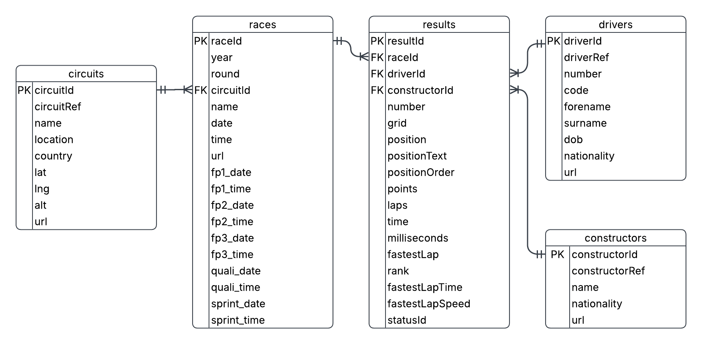
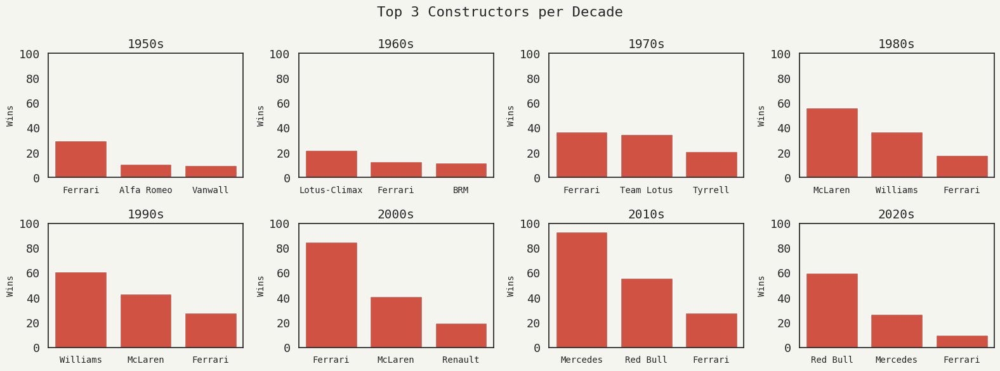

# Formula 1 SQL Analysis


  

SQL analysis of Formula 1 World Championship data (1950–2024), relational database design and advanced queries (window functions, CTEs, subqueries and aggregations) visualised with Python.


## Dataset
[Formula 1 World Championship Dataset](https://www.kaggle.com/datasets/rohanrao/formula-1-world-championship-1950-2020)


The Entity Relationship Diagram was designed manually in [Lucidchart](https://www.lucidchart.com).

## Key Questions
- How has Formula 1 grown over the decades?
- Which constructors dominated and in which eras?
- Who were the greatest drivers?
- What do circuits tell us about danger and overtaking opportunities?

## Key Findings

- **Lewis Hamilton** leads in points (4,820), wins (105), and podiums (220)
- **Ferrari** is the only constructor to appear in every decade's top 3, symbolising long-term success
- The number of drivers dropped from **332 in the 1950s to 66 in the 2010s**, reflecting the increasing cost of competing in F1
- **Historic circuits** have significantly higher DNF rates and more overtaking opportunities than modern tracks



## How to Run
1. Clone the repository
2. Install dependencies: `pip install -r requirements.txt`
3. Run `create_db.py` to build the database
4. Open `analysis.ipynb` in Jupyter Notebook

## Project Structure

```text
formula1-sql-analysis
│   analysis.ipynb          # main analysis notebook
│   create_db.py            # builds SQLite database from CSV files
│   data_overview.ipynb     # data table structure overview
│   README.md               
│   requirements.txt        # required Python libraries
│   
├───data                    # raw CSV files from Kaggle
│       circuits.csv        
│       constructors.csv
│       drivers.csv
│       races.csv
│       results.csv
│       
├───db
│       formula1.db         # SQLite database
│       
└───images
        ERD.png             # Entity Relationship Diagram
        sample_plot.png             
```

